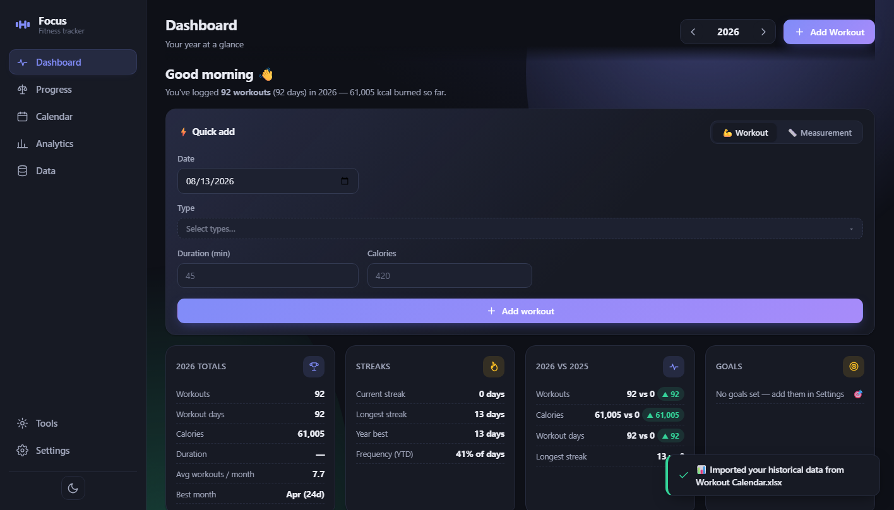
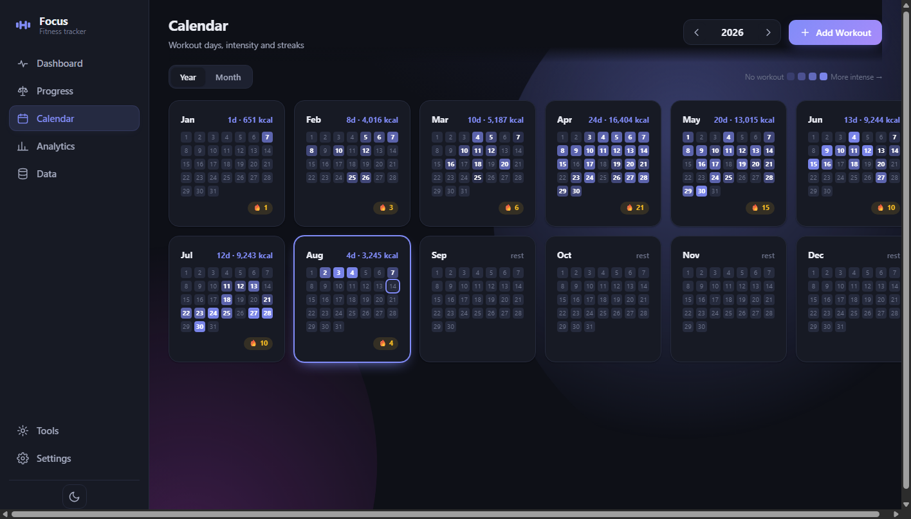
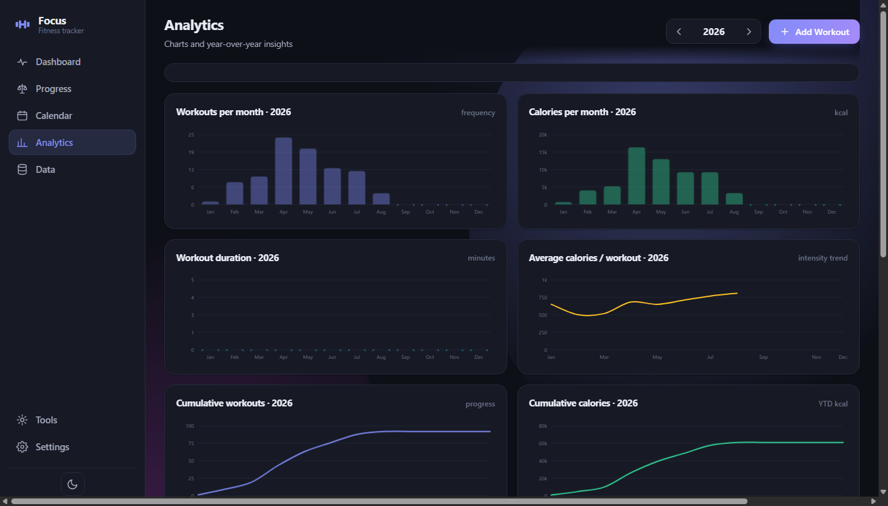
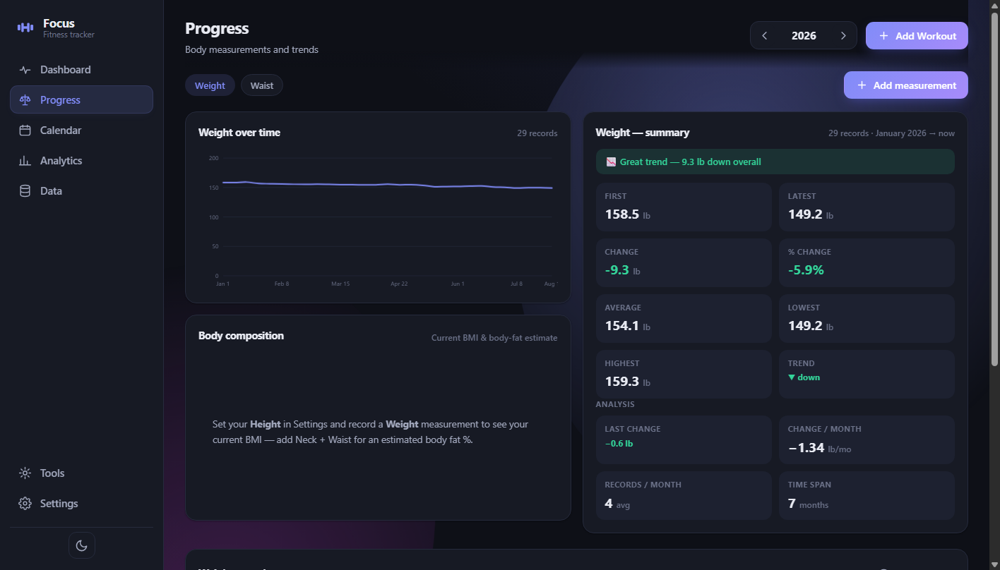
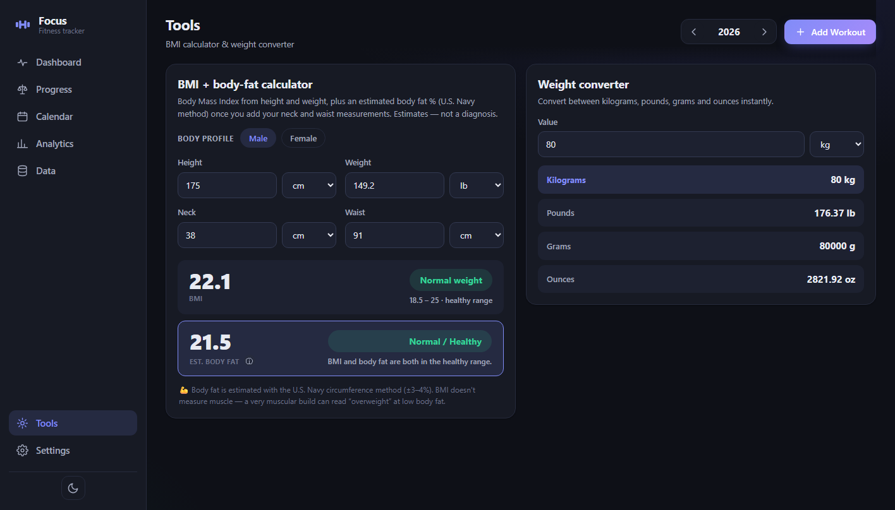
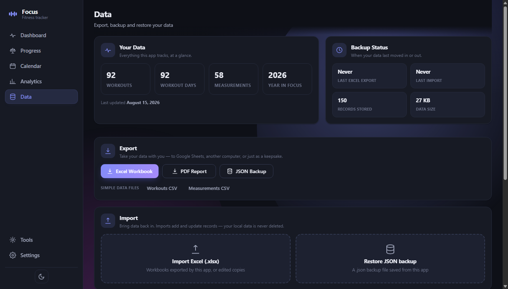

# Focus — Workout & Fitness Tracker

A **private, 100% offline** web app for tracking workouts, calories, body
measurements and yearly fitness statistics — a modern replacement for the
`Workout Calendar.xlsx` spreadsheet, with Excel export/import for Google
Sheets archiving.

**No installation. No accounts. No cloud. No internet required.** Just open
the HTML file and start.

## Screenshots

| | |
|---|---|
|  |  |
|  |  |
|  |  |

*Screenshots show the app in dark mode with the built-in demo data (your seed
history of 92 workouts across Jan–Aug 2026).*

## Features

- 📊 **Dashboard** — year totals, streaks, year-vs-year and goals KPI cards, then **This Week / This Month** cards that benchmark **9 metrics** against the previous period (hover any ▲/▼ pill to reveal the previous period's value), then the Workouts-per-month and cumulative-calories charts and recent activity
- 📅 **Calendar** — GitHub-style heatmap with intensity levels, a month view with a day panel (tap a day to drill in, tap elsewhere to return to the month summary), and subtle marking of your best day and the current month
- 📏 **Progress** — weight, waist, neck, height… any measurement, any frequency. Trend charts, a **Body composition** card (current BMI + estimated body fat %, computed from your records — no re-entry) and a summary with colored trend highlights
- 📈 **Analytics** — monthly workouts / calories / duration, cumulative lines, workout-type distribution, a consistency heatmap (with a 🏆 best-month badge and 🔥/⏱️ goal chips; click a month to open it in the Calendar), and a year-over-year comparison (current vs previous year by default)
- 💾 **Data & Backup** — a friendly **Excel workbook**, a local **PDF annual report**, a full-fidelity **JSON backup** and CSV exports, with a safe import preview that adds & updates but never deletes — plus a **biweekly backup reminder** so your JSON backups never go stale
- 🧰 **Tools** — **BMI + body-fat calculator** (U.S. Navy method, male/female formulas) with a combined interpretation and a ⓘ explainer, plus a weight converter
- 🎯 **Goals** — a daily **calorie goal (🔥)** and a daily **duration goal (⏱️)** that complete independently, plus a weekly workout target; see them on the dashboard, as 🔥/⏱️ badges on goal days in the calendar (a day earns a gold ring only when every configured goal is met), and as separate hit-rate bars in Analytics
- ⚙️ **Settings** — dark/light theme, **accent color** (violet, orange, green, red, blue), an **animations** toggle (ambient background glows, card highlights, chart draw-ins; on by default and respects your system's reduced-motion preference), weight unit (kg/lb), body profile (sex, **height**, age — set once), goals, privacy and a **backup reminder** toggle with a configurable interval (default every 10 days)

## Getting started

1. Copy the folder anywhere you like (USB stick, laptop, desktop).
2. Double-click **`Focus-Workout-Tracker.html`** — it opens in Chrome, Edge, Firefox or Safari.
3. Start using it. There is no server, no build step, no terminal, no install.

> **Opening from `file://`** — everything works when opening the HTML directly,
> including storage, charts, PDF reports and Excel import/export. Data lives in
> the browser's IndexedDB, which is tied to how the browser treats the
> `file://` location (Chrome/Edge may keep data even if the folder moves;
> Firefox/Safari may tie it to the exact path). Keep the folder somewhere
> permanent, and before moving machines or clearing browser data use
> **Export JSON backup** and import it on the other side.

## Data & backups

All data lives in your browser's **IndexedDB** — a real local database. Every
change saves automatically (there is no "Save" button) and nothing is ever sent
anywhere. Storage is per-browser, so to move data between browsers or computers:

1. **Data → Export JSON backup** — a complete snapshot (workouts, measurements, settings), saved as `focus-workout-YYYY-MM-DD.json`.
2. Move the file, then **Data → Import JSON backup** on the other side.
   Imports are deduplicated — importing twice never creates duplicates.

- **Export Excel** produces a spreadsheet-friendly copy with clean, human-readable sheets (`Overview`, `Workouts`, `Measurements`, `Monthly Summary`, `Yearly Summary`, `Analytics`) that read perfectly in Google Sheets. A hidden `_AppData` sheet carries the internal record IDs and timestamps, so re-import is exact.
- **Google Sheets archiving**: export → upload → archive; later download as `.xlsx` and import back. Imports show a preview (will add / will update / unchanged / invalid) and never delete local records — they match on stable ID, then identical content, then a human-edit key, and only add what's genuinely new.
- **Export PDF Report** builds a multi-page **Progress & Analytics Report** locally — see below.
- **Backup reminder** — a dismissible banner at the top of the Dashboard that appears **every N days after your last JSON backup** (N defaults to 10, configurable in **Settings → Privacy**; it also shows if you've never backed up). **Back up now** exports and restarts the countdown, **Not now** / **✕** dismisses it for the day, and the whole thing can be switched off in Settings.

<details>
<summary><b>PDF report — what's inside</b></summary>

The report doesn't just print numbers — it interprets them, with every statement
backed by your data (nothing estimated or invented):

1. **Cover / Executive summary** — reporting period, a plain-language summary, four highlight metrics and the top insights
2. **Executive Summary** — narrative insight cards (volume, consistency, month-by-month, body measurements)
3. **Key Performance Indicators** — KPI cards with year-over-year deltas plus a training-mix donut
4. **Progress Analysis** — monthly charts for workouts / calories / duration, each with a written interpretation (peak month, quietest month, biggest jump)
5. **Monthly Performance** — one compact table of every month with a totals row and at-a-glance highlights
6. **Year-over-Year** — comparison KPIs, grouped monthly bars and cumulative calorie lines, plus a written reading; skipped when the comparison year has no workouts
7. **Measurements** — per type: initial / latest / change (+%), a trend line, and a neutral interpretation
8. **Consistency & Streaks** — a full-year activity heatmap, active-day %, streaks and the longest inactivity gap
9. **Key Takeaways** — 3–7 closing insights

Technical notes: insights come from a pure analytics engine in `stats.js`;
a layout engine reserves each block's height so charts are never clipped and
headings never dangle at a page bottom; training mix counts **type mentions**
(explicitly labeled, e.g. "120 mentions across 102 workouts") with the tail
folded into a single Other bucket; charts stay vector with value labels, and a
bundled Unicode font keeps symbols legible.

</details>

## How workouts work

- **Multiple workouts per day** are allowed — a day with 2 workouts shows both as compact cards, and daily totals are summed automatically.
- **A workout can have several types** — pick as many as you want (e.g. **Back + Biceps**); each gets its own colored badge and Analytics counts them separately. Preset types: **Back, Chest, Legs, Biceps, Triceps, Forearms, Abs, Cardio** plus **➕ custom** types. Old "Other"/"Strength" records keep their styling.
- A **workout day** = a calendar day with at least one workout; for streaks, 2 workouts on the same day still count as **one** day.
- **Current streak**: consecutive workout days ending today — or yesterday if today has none yet (the streak stays alive until today ends).
- Entry requires only **date + type**; duration, calories and notes are optional. Negative values and invalid dates are rejected.
- Use **⚡ Quick add** on the Dashboard (switch to the 📏 Measurement tab for weight/waist/etc.), the **+ Add Workout** button anywhere, or click a day on the calendar.

## How measurements work

- Measurements are **completely date-based** — record them daily, weekly or monthly, whenever you like.
- Built-in types: Weight, Body Fat %, Height, Neck, Waist, Chest, Hips, Arm, Thigh — plus **custom measurements** and custom units.
- For each type the app computes First, Latest, Change, % Change, Average, Lowest, Highest and a trend — **only from records that actually exist** (no fake "monthly" assumptions).

## How BMI & body fat work

- **BMI** = weight (kg) ÷ height (m)², categorized with the WHO bands. It needs only height and weight. **Height lives in Settings** (it barely changes) — a recorded Height measurement is only a fallback.
- **Estimated body fat** uses the **U.S. Navy / Hodgdon circumference method** (men: waist & neck; women: waist, hips & neck — all vs height). It appears only when every required measurement is present; until then the UI tells you exactly which one to add. It's an estimate (±3–4%), never a diagnosis.
- The two are read together: body fat is the primary signal and BMI modulates the wording, so a high BMI with low body fat reads **"Very Athletic / Muscular"** rather than overweight.
- The **Tools** calculator prefills from your latest records, and the **Progress** view's *Body composition* card computes the same numbers from stored data — you never enter the same value twice.

## Yearly comparisons

- The year picker (‹ 2026 ›) switches any view to any year — past or future, with or without data.
- **Dashboard** shows your year vs the previous year; **Analytics** lets you compare **any two years** (per-month bars, cumulative lines, totals with differences) — the comparison only appears when both years actually have data.

## Privacy

**Focus never sends data anywhere.** No analytics, no telemetry, no external
requests — the entire app (including the Excel and PDF libraries and every
chart) is bundled in this folder and runs from your own files. Disconnect the
internet completely and everything keeps working.

---

<details>
<summary><b>Data model, historical data & project layout</b></summary>

### Data model

Each record has a stable `id` that survives edits, backups, exports and restores.

```javascript
// Workout — type holds one or more comma-separated types
{ id: "id-…", date: "2026-08-07", type: "Back, Biceps",
  duration: 45, calories: 420, notes: "", createdAt: "…", updatedAt: "…" }

// Measurement
{ id: "id-…", date: "2026-08-01", type: "Weight",
  value: 79.8, unit: "kg", notes: "", createdAt: "…", updatedAt: "…" }
```

Years are discovered automatically from the data. The exported Excel keeps the
human sheets clean (`Date, Workout Type, Duration (min), Calories, Notes`) and
moves internal fields (IDs, timestamps, schema version) into the `_AppData`
sheet, so export → import round-trips are byte-for-byte identical (verified by
the automated smoke test).

### Your historical data (Workout Calendar.xlsx)

On **first launch** the app automatically loads your history — **92 workouts
(61,005 kcal, Jan–Aug 2026)** and **58 body measurements** — so the dashboard
lights up with real data immediately. Re-import it any time via *Data →
Restore built-in historical data* (fully deduplicated). The workbook stores
calories by overwriting a day cell in a yearly grid, so the import assumed:

1. Each calendar day with a calorie number = **one workout** (no type/duration
   recorded, so all are typed **"Other"** — editable later).
2. The "Workout Calendar" template sheet (all zeros) was ignored; data came
   from the **"2026"** sheet.
3. Measurements (waist in cm, weight in lb) are weekly, noted by "week number +
   month", so dates were mapped to the **1st, 8th, 15th, 22nd** of each month.
4. Calories verified against the workbook's own totals:
   `92 days · 61,005 kcal · monthly sums all match`.

### Offline test checklist

- [x] Dashboard renders with your year's stats
- [x] Add a workout (also 2+ on the same day, also with multiple types) → totals update instantly
- [x] Edit / delete a workout (delete asks for confirmation)
- [x] Add a historical workout from a previous year
- [x] Add, edit and delete a measurement
- [x] Switch years, view calendar, drill into a month and a day
- [x] Day panel shows multiple workouts as horizontal cards
- [x] Compare any two years in Analytics
- [x] Export Excel — opens in Excel & Google Sheets; re-import → "0 new"
- [x] Export PDF report for a year with data
- [x] Export JSON backup, reset, import backup → everything restored
- [x] Backup reminder: banner on the Dashboard every N days since the last JSON backup (default 10); "Back up now" exports and restarts the countdown, ✕ dismisses for the day; interval + toggle in Settings → Privacy
- [x] Dark / light mode, accent color and animations toggle (remembered between sessions); ambient glows, card highlights and chart draw-ins turn off with the toggle or reduced motion
- [x] Close the browser, reopen `Focus-Workout-Tracker.html` → data is still there
- [x] Works with the network cable unplugged

A repeatable automated smoke test lives at `app/tests/smoke-test.html` — open
it in a browser and it prints pass/fail for dozens of checks against the core
logic, including the exact Excel round-trip. Exports and imports live in the
**`data/`** folder — see `data/README.md`.

### Project layout

```
WorkoutTracker/
├── Focus-Workout-Tracker.html  ← open this
├── README.md
├── app/                    ← everything the app needs, in one folder
│   ├── css/                ← design system, light + dark themes, accents, motion
│   │   └── app.css
│   ├── js/                 ← application source
│   │   ├── app.js          ← bootstrap & wiring
│   │   ├── charts.js       ← SVG charts (zero dependencies)
│   │   ├── excel.js        ← .xlsx/.csv import & export (styled workbook)
│   │   ├── pdf.js          ← local PDF annual report builder
│   │   ├── seed-data.js    ← your historical data, embedded
│   │   ├── stats.js        ← streaks, monthly/yearly, comparisons, insights
│   │   ├── store.js        ← IndexedDB persistence + dedup + multi-type normalize
│   │   ├── ui.js           ← all views & dialogs
│   │   └── version.js      ← app version (auto-managed by tools/bump-version.py)
│   ├── lib/                ← bundled locally, no CDN
│   │   ├── jspdf.umd.min.js ← PDF library
│   │   ├── xlsx.full.min.js ← SheetJS
│   │   └── fonts/fonts.js   ← embedded Unicode font for the PDF report
│   ├── shortcut-icon.ico   ← app icon (browser tab favicon + desktop shortcut)
│   ├── screenshots/        ← images used in this README
│   └── tests/              ← optional automated checks
│       └── smoke-test.html
├── tools/                  ← development tools
│   └── bump-version.py     ← auto-bumps the app version after changes
└── data/                   ← keep your Excel/JSON exports & imports here
```

</details>

## Version bumping

Settings → About shows the app version (`app/js/version.js`). After you change
the program, bump it with:

```
python tools/bump-version.py
```

The script fingerprints the source files, compares them with the last run and
classifies the combined change itself — **major** for a big rework (a large
amount of churn, never bumped lightly), **minor** for a solid change, **patch**
for a small touch-up — then updates `app/js/version.js` and prints what it found.
The version keeps to the project's limits: the **minor** digit never passes 20
and the **patch** digit never passes 100; at those ceilings the next bump rolls
into a major / minor respectively.
